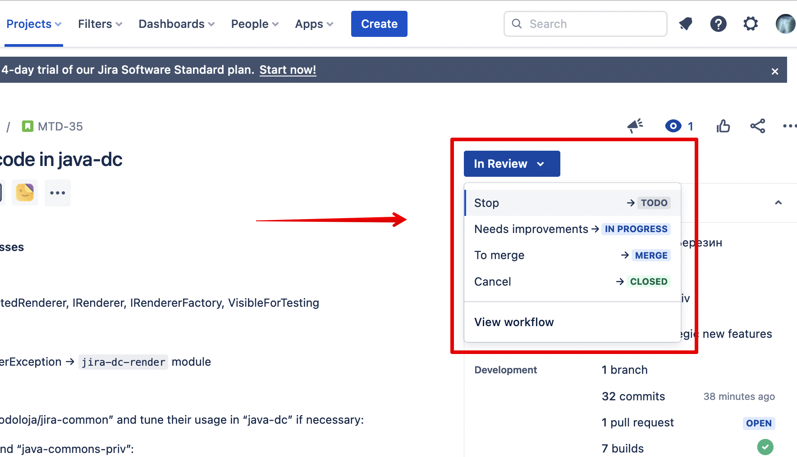
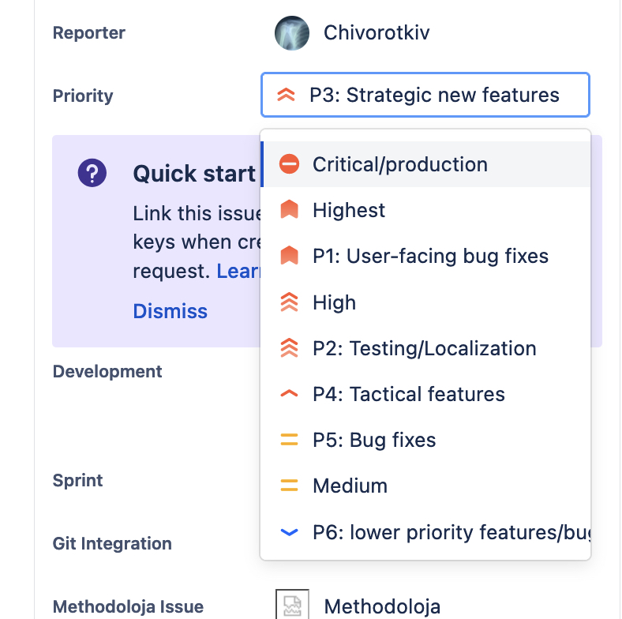
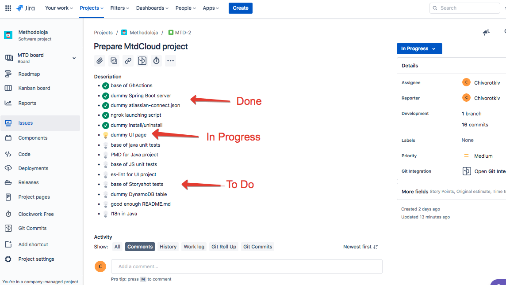

[README](/README.md) / Workflow

# Workflow

## TLDR

> The principle of organizing work at the most basic level is as follows: if a task is assigned to you (Assignee), it means that the next action on it is expected from you. If there is a problem, a question, or a deadlock situation, the task is reassigned to someone who can answer the question, resolve the situation, or otherwise take the next step on the task. The goal is to get rid of all assigned tasks and take on new ones.
>
> Regarding the value of tasks:
>
> - The further to the right a task has progressed, the more valuable it is, which adds to its priority.
> - Answering questions, code reviews, and other similar actions are also prioritized because the work of other people is blocked by such actions.
> - P1 User-facing bug fixes are a special priority because they mark something truly urgent. Other priorities are less strict.
> - If something can be done quickly, it may slip through before more prioritized but voluminous tasks.

## Glossary

In a general text: `card = issue = ticket = task`, regardless of the specific issue type in Jira.

## Task Management Process

We use Jira for project management. That's where the cards live. Most cards move from left to right: they are created in the far-left column, finish their journey in the far-right column, and then go to the archive.

> It's like a game: the goal of the game is to move all the cards to the far-right column.

Cards do not move between columns by themselves; people move them. To move a card from one column to another, you need to select it and change its status, either sending it forward or moving it back:

The person to whom the task is assigned is responsible for the next step. The next step might be absent for various reasons, such as:

- Everything is done at this stage
- The task has reached a dead end
- Help is needed
- It's unclear what needs to be done

If the responsible person does not see the next step, they look for someone to reassign it to and reassign it. In clear situations, they find a colleague to reassign the task to themselves. In unclear situations, they reassign it to their direct supervisor, who will decide what to do next with the card.

> It's like a game: the player's goal is to get rid of their card.

If today a card is assigned to a developer, we expect that it will soon be moved to the "In Progress" column, and immediately after that, commits will be made to the repository. If something needs to be approved for the task, it should be immediately reassigned to the person expected to provide that approval. If a developer has a question, they reassign the card to the person who they believe should answer the question. If the task appears to be completed, it should be reassigned to its creator for confirmation.

### Example

If you see that I'm not responding but want to subtly indicate that you're waiting for my reply, assign the card to me. This signals that I need to take some action.

Here’s how it works:

- Whoever has the ticket has the next move. The goal is to get rid of your tickets.
- Asked a question: assign the ticket to the person you expect an answer from.
- Need a review: assign the ticket to the reviewer.
- Need to fix something: assign the ticket to the person who will fix it.
- Reached an intermediate result but unsure whether to proceed or do more here: assign the ticket to someone who can evaluate.
- Hit a dead end: assign the ticket to someone who can help you out.
- If there are many people in the team, hit a dead end, and don’t know who to assign it to: assign the ticket to the manager, so they can decide who can help you out.

In this situation, I would look and, for instance, not understand what is expected of me. Then one of the following would happen:

- I would write something like, "You assigned the ticket to me, do you have a specific question?" and reassign it back to you. This would signal to you to extract questions from the report above or rephrase the current problems.
- I would write, "Great, keep up the good work," and reassign the ticket back to you. This would signal that I didn’t understand I was being asked something. You would rephrase the questions and assign it to me again.

If there is no reassignment, it means I perceived the comment in Jira as:

- You reported the current progress and continue working.
- I grabbed some popcorn and wait for the next report to read.

But I would be wrong in this case. The correct strategy for me to avoid this repeating:

- Write at least something in response. You’ll understand that I wrote something silly and didn’t get the question, and rephrase it.

### Don’t ignore Jira comments

From the example above, the following rule can be derived:

_Do not ignore comments in Jira, and respond to them even if it seems like just a regular update._

You should write something like "Got it, keep up the good work." If it was an update, then that's fine. If it was a question, the person asking will understand that you didn't get the question and will ask it more clearly.

## Nuance of Working with Jira

In comments, mention the person you're addressing using @ to ensure they receive a notification.

For particularly interesting cards, you can subscribe as a watcher to track all changes.

## Priorities

Configured priorities: https://evoja.atlassian.net/secure/ShowConstantsHelp.jspa?decorator=popup#PriorityLevels

We use the following priority system:

`Critical` and `Highest` tasks need to be done urgently, ahead of all other tasks, practically yesterday. These are usually serious production bugs.

At the same time, tasks that are closer to completion should receive higher priority. Thus, tasks in code review are generally more urgent than those in progress, and ready-to-merge tasks are more urgent than those in code review.

Additionally, tasks that require a short action but block someone else's work, such as answering a question or reviewing code, should be addressed as soon as possible.

## Issue types

Configured types: https://evoja.atlassian.net/secure/ShowConstantsHelp.jspa?decorator=popup#IssueTypes

**Epic:** Target cards that explain the bigger goal. They describe the major task that the new functionality, currently being developed, aims to solve.

In the PsEnv project, we used these tasks to represent major phases of work. For example, the first phase: registering those interested in participating; the second: managing groups and schedules; the third: tracking attendance and grades; the fourth: posting educational materials, and so on.

Here, sprints largely fulfill this role, but we’ll see how it goes.

## Statuses

When you start working on a task, move it to `In Progress`.

When you create a pull request and fix everything you intended to fix, send the task to `Code Review` and assign it to the reviewer.

The reviewer, after reviewing, moves the task to `Merge` and assigns it to the person who will merge.

The person assigned the task in `Merge` merges it and moves the task to Done.

When you move a task to `Done`, assign it to the task's creator/nurse, or the manager.

## Planning

Use the ticket description for planning the work with light sub-tasks and showing the progress:

It's convenient to use text that automatically converts into icons:
`(/)` , `(on)`, `(off)`, `(!)`, `(?)`, `(-)`, `(x)`

* `(/)` ready
* `(off)` to-do
* `(on)` in-progress
* `(!)`, `(?)`, `(-)`, `(x)` various types of issues and questions

## Code review

The goal of the process is approximately as follows:

— If you can extract some benefit for yourself from the changes you see, you do so.

— If you can ask questions, you ask them.

You don't need to go into great detail about what has been done. The level of detail should be light—just enough to understand what's happening and stay informed.

Complex issues that arise during development should be discussed immediately, rather than leaving them for the review. Do not expect the reviewer to catch subtle bugs in the code.

## Git for Jira

When making commits, include the Jira card designation in the commit message, such as DEP-1, DEP-2, etc. You don't need to include the full link to the ticket.

Commits with these designations appear at the bottom of the card in the `Commits` section.

Branches and pull requests are also reflected in the _Git Integration_ side panel.

## Jira comments

If a task takes a long time to complete, it makes sense to periodically describe the current progress in the task's comments.

> Imagine a larger company. A comment on the task is needed for the next person who takes over the task, so they can understand what has been done and what needs to be done next.
